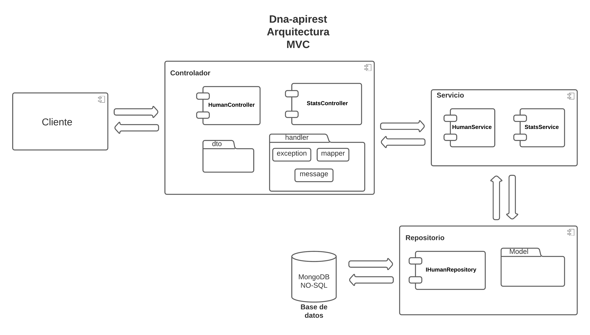
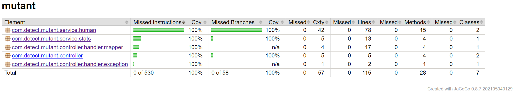
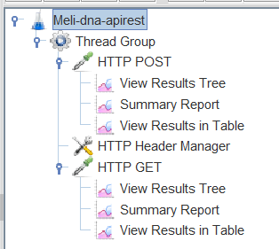
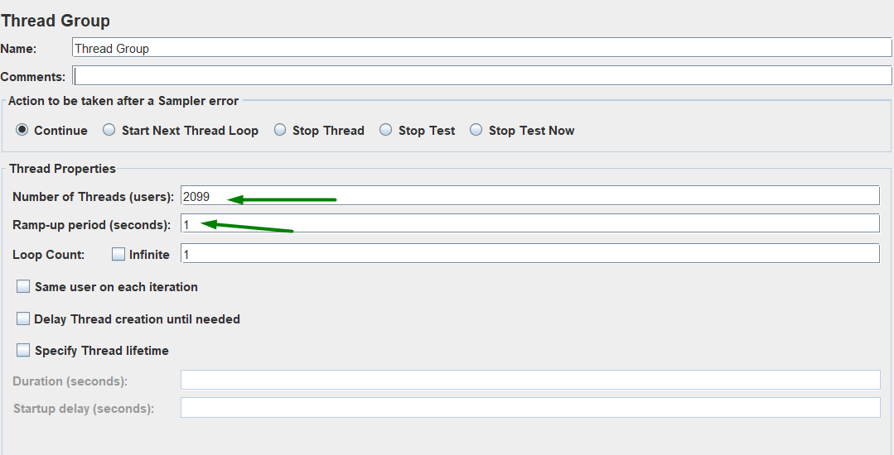
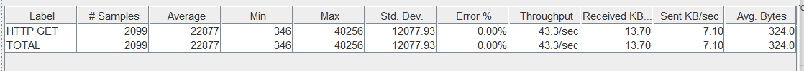
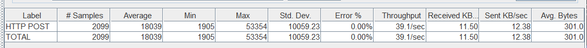

# dna-apirest
Este repositorio contiene el proyecto dna-apirest, el cual permite identificar secuencias de adn y obtener estadísticas 
de las mismas.

## Contexto
Debido a la necesidad de Magneto de luchar contra los X-Men, requiere reclutar la mayor cantidad 
de humanos mutantes para destruir a los X-Men. Es así como necesita de un api para identificar humanos normales y
mutantes.


## Descripción
Este api permite identificar si un humano es mutante o no, a partir de la secuencia de ADN. El api recibe la secuencia 
de adn y devuelve un mensaje "Humano!!! Fuera de acá" en caso de que la secuencia sea de un humano normal y devuelve 
"Mutante!!! Bienvenido a Magneto Club" cuando se identifica que es un humano mutante. Si se hace el envío de una
secuencia de adn incorrecta o con mal formato se devuelve el mensaje "Formato del ADN incorrecto". Adicionalmente, 
permite consultar las estadísticas de mutamtes y humanos guardados en la base de datos.

## 💻 Datos técnicos

### 📝 Arquitectura


El proyecto se realizó siguiento una arquitectura MVC (Modelo - Vista - Controlador). La cual está estructurado de la 
siguiente forma

#### Cliente
Es el que consume el api, puede ser un front-end, un consumidor de apis de desarrollo como postman, insomnia, swagger,
etc. Se encarga de hacer la peticiones a la api y de procesar las respuestas.

#### Controlador
Es la capa de comunicación directa con el cliente, en donde se construyen y se exponen los servicios de la aplicación.
Para este caso es una aplicación orientada a microservicios y se tienen 2 servicios, humanController y statsController.
El primero de éstos expone el servicio para saber si una secuencia de adn es mutante o no y el segundo permite ver las 
estadísticas de los mutantes en base de datos. Básicamente, es un puente entre el cliente y los modelos. También contiene 
los dtos y algunos handlers.

#### Servicio
Es una capa intermedia que contiene la lógica de la aplicación implementada, manipula los objetos de datos y le devuelve 
la información necesaria al controlador. Se tiene la lógica tanto para detentar un mutante y para las estadísticas.

#### Repositorio
Es la capa de más bajo nivel donde se trabaja directamente con los datos y el acceso a la base de datos. Se utilizó la 
interface MongoRepository para la comunicación con la base de datos y se definió el modelo de Human que representa el 
documento en la base de datos NO-SQL de mongoDB

#### Base de datos
Base de datos NO-SQL creada en MongoDB para almacenar los adns consultados, un sólo registro por cada secuencia de adn.

### 🚀 Despliegue
La aplicación fue desplegada en el servidor gratuito de Heroku, utilizando Docker para su despliegue, la configuración 
del Dockerfile es la siguiente:
```
FROM openjdk:17-jdk-alpine
ARG JAR_FILE=target/*.jar
COPY ${JAR_FILE} app.jar
ENTRYPOINT ["java","-jar","/app.jar"]
```

### ☕ Lenguajes frameworks y librerías
El proyecto se desarrolló usando el framework SpringBoot junto con la versión 17 de Java, Junit, Jacoco, lombok, Docker,
Heroku y base de datos MongoDB (NO-SQL).

## 🤖 Uso de la app
Para utilizar la aplicación se debe acceder desde un cliente de apis de la siguiente manera:

### Post */mutant/* 
Consultar si una secuencia de adn es mutante o no: se debe generar una petición de tipo **POST** al siguiente endpoint 
```https://dna-apirest.herokuapp.com/mutant``` enviando como request la estructura del body.

``` Request ```

```
  {
    "dna": [
        "string"
    ]
  }
```
Y como respuesta se resivirá un Ok 200 si el adn es mutante, un 403 Forbidden, en caso de que sea humano y un 400 
bad request si el dna no tiene el formato esperado.

``` Response ```
``` 
{
	"message": "Mutante!!! Bienvenido a Magneto Club"
} 
```
```
{
	"message": "Humano!!! Fuera de acá"
}
```

### Get */stats/*
Consultar las estadísticas de los humanos y mutantes guardados en base de datos. La url para la consulta es la siguiente:
```https://dna-apirest.herokuapp.com/stats``` mediante el método **Get**.
No requiere body ni params y retorna un objeto de tipo json con las estadísticas

```
  {
      "countMutantDna": 0,
      "countHumanDna": 0,
      "ratio": 0
  }
```
### Documentación del API
Para mayor claridad y entendimiento del api se realizó una documentación mediante swagger UI.
A continuación se deja el link para su acceso, además desde el mismo swagger se puede probar las funcionalidades del api.
```https://dna-apirest.herokuapp.com/swagger-ui.html```

### Test automáticos
La aplicación cuenta con test automatizados con cobertura por encima del 80%.



### 👨🏽‍💻 Análisis de código
Se utilizó la extensión **SonarLint** para identificar code smell y recomendaciones de mejora de calidad y seguridad del 
código en general.

### 🔨 Pruebas de rendimiento JMeter


Se realizaron pruebas de rendimiento de la aplicación, recibiendo tráfico de peticiones por segundo, se probó desde
100 usuarios por segundo hasta 3000, respondiendo correctamente la aplicación **2100** sin presentar error en la petición.

#### Http Get



#### Http Post

